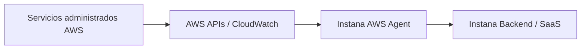
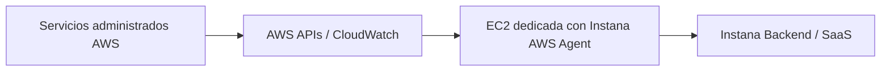
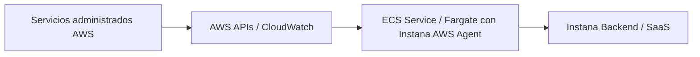

# Integración de IBM Instana AWS Agent con AWS CloudWatch y APIs AWS

## Servicios AWS soportados por Instana AWS Sensor

De acuerdo con la documentación pública **latest** de IBM Instana, el **Instana AWS Agent / AWS Sensor** permite monitorear servicios administrados de AWS mediante APIs de AWS, como CloudWatch, S3 y X-Ray.

Los servicios AWS soportados por el sensor AWS son:

| N.° | Servicio AWS soportado | Comentario |
|---:|---|---|
| 1 | API Gateway | Monitoreo de APIs administradas en AWS |
| 2 | AppSync | Monitoreo de APIs GraphQL administradas |
| 3 | Auto Scaling | Monitoreo de Auto Scaling Groups |
| 4 | Beanstalk | Monitoreo de ambientes AWS Elastic Beanstalk |
| 5 | CloudFront | Monitoreo de distribuciones CDN |
| 6 | DocumentDB | Monitoreo de clusters Amazon DocumentDB |
| 7 | DynamoDB | Monitoreo de tablas Amazon DynamoDB |
| 8 | EBS | Monitoreo de volúmenes Amazon EBS |
| 9 | EC2 | Monitoreo de recursos EC2 desde APIs AWS |
| 10 | ElastiCache | Monitoreo de clusters Amazon ElastiCache |
| 11 | OpenSearch | Monitoreo de dominios Amazon OpenSearch Service |
| 12 | ELB | Monitoreo de Elastic Load Balancing |
| 13 | EMR | Monitoreo de clusters Amazon EMR |
| 14 | IoT Core | Monitoreo de recursos AWS IoT Core |
| 15 | Kinesis | Monitoreo de Amazon Kinesis |
| 16 | Lambda | Monitoreo de funciones AWS Lambda |
| 17 | MSK | Monitoreo de Amazon Managed Streaming for Apache Kafka |
| 18 | MQ | Monitoreo de Amazon MQ |
| 19 | RDS | Monitoreo de instancias y clusters Amazon RDS |
| 20 | Redshift | Monitoreo de clusters Amazon Redshift |
| 21 | S3 | Monitoreo de buckets Amazon S3 |
| 22 | SNS | Monitoreo de tópicos Amazon SNS |
| 23 | SQS | Monitoreo de colas Amazon SQS |
| 24 | Timestream | Monitoreo de bases de datos Amazon Timestream |
| 25 | X-Ray | IBM lo lista como soportado, pero marcado como deprecated |

Referencias públicas latest de IBM Instana:

- Monitoring Amazon Web Services (AWS) with Amazon Web Services (AWS) agent  
  https://www.ibm.com/docs/en/instana-observability?topic=agents-amazon-web-services-aws

- Amazon Web Services IAM configuration  
  https://www.ibm.com/docs/en/instana-observability?topic=aws-amazon-web-services-iam-configuration

---

## 1. Objetivo

El objetivo de este documento es describir el procedimiento para integrar **IBM Instana AWS Agent** con **AWS CloudWatch** y APIs de AWS, considerando dos modalidades de despliegue:

1. **AWS Agent en EC2**, para monitorear servicios administrados de AWS mediante CloudWatch y APIs AWS.
2. **AWS Agent en ECS/Fargate**, para ejecutar el AWS Agent como un servicio ECS.

Este documento no cubre la instalación del Host Agent para monitoreo de servidores, aplicaciones, contenedores o nodos EC2. El alcance se centra únicamente en el **AWS Agent / AWS Sensor**.

---

## 2. Concepto general de la integración

Los servicios administrados de AWS no permiten instalar un agente directamente dentro del servicio. Por ejemplo, no se instala un agente dentro de RDS, Lambda, SQS, SNS, S3 o DynamoDB.

Para estos casos, Instana utiliza el **AWS Agent**, el cual consulta información desde APIs de AWS, principalmente:

- Amazon CloudWatch.
- AWS STS.
- APIs propias de cada servicio AWS.
- AWS Resource Groups Tagging API, cuando se usan filtros por tags.
- APIs adicionales según el servicio monitoreado.

El flujo general es el siguiente:



---

## 3. Modalidades soportadas para instalar AWS Agent

IBM Instana permite instalar el AWS Agent en:

| Modalidad | Descripción | Uso recomendado |
|---|---|---|
| AWS Agent en EC2 | El agente corre en una máquina EC2 dedicada | Recomendado cuando el cliente desea controlar la instalación como servicio Linux |
| AWS Agent en ECS/Fargate | El agente corre como una tarea/servicio ECS | Recomendado cuando el cliente no desea administrar una EC2 dedicada |

Ambas modalidades cumplen el mismo objetivo funcional:

```text
Recolectar información de servicios administrados AWS mediante CloudWatch y APIs AWS.
```

---

## 4. Consideraciones importantes

Antes de implementar, considerar lo siguiente:

1. Se recomienda instalar **un solo AWS Agent por combinación de cuenta AWS y región AWS**.

2. No se recomienda instalar múltiples AWS Agents para la misma cuenta y región, porque puede generar costos adicionales en AWS CloudWatch sin mejorar la calidad del monitoreo.

3. Las métricas obtenidas desde CloudWatch pueden tener demora en su visualización. IBM indica que la demora depende del servicio AWS y de la disponibilidad del dato, pero usualmente puede estar alrededor de 10 minutos.

4. El AWS Agent necesita permisos IAM de lectura para descubrir recursos y obtener métricas.

5. Si se usa filtrado por tags, se debe incluir el permiso:

```text
tag:GetResources
```

6. El intervalo de consulta a CloudWatch es configurable mediante:

```yaml
cloudwatch_period
```

7. El valor por defecto del intervalo de consulta es 300 segundos.

8. Un menor intervalo mejora la granularidad, pero puede incrementar costos por llamadas a CloudWatch.

9. Un mayor intervalo puede reducir costos, pero disminuye la granularidad de las métricas.

10. Si se monitorean muchas entidades AWS, puede ser necesario aumentar la memoria máxima del agente mediante:

```bash
AGENT_MAX_MEM=1024M
```

---

## 5. Prerrequisitos

### 5.1 Prerrequisitos en Instana

Se requiere contar con:

- Acceso a la consola de IBM Instana.
- Agent Key.
- Endpoint o location del tenant Instana.
- Permisos para acceder a la sección de instalación de agentes.
- Definir si el AWS Agent será desplegado en EC2 o ECS/Fargate.

Ruta en la consola de Instana:

```text
More > Agents > Install agents > AWS
```

Seleccionar:

```text
Technology: Instana AWS Sensor
```

---

### 5.2 Prerrequisitos en AWS

Se requiere contar con permisos para:

- Crear políticas IAM.
- Crear roles IAM.
- Asociar roles a instancias EC2 o Task Definitions de ECS.
- Crear o modificar EC2, si aplica.
- Crear o modificar ECS Task Definition, si aplica.
- Crear o modificar ECS Service, si aplica.
- Validar conectividad hacia Instana.
- Validar conectividad hacia CloudWatch, STS y APIs AWS.

---

### 5.3 Conectividad requerida

El recurso donde se ejecute el AWS Agent debe tener salida hacia:

```text
Instana Backend / Instana SaaS
AWS STS
Amazon CloudWatch
AWS Resource Groups Tagging API
APIs de los servicios AWS monitoreados
```

En ambientes privados se debe validar si la salida será mediante:

- NAT Gateway.
- Proxy corporativo.
- VPC Endpoints.
- AWS PrivateLink.
- Reglas de firewall.
- Security Groups.
- Network ACLs.

> Nota: Para el uso de Resource Groups Tagging API, IBM indica que no se puede usar VPC endpoint para dicha API, por lo que puede requerirse salida pública o proxy.

---

## 6. IAM requerido para AWS Agent

El AWS Agent necesita una política IAM con permisos de lectura para CloudWatch y para los servicios AWS que serán monitoreados.

### 6.1 Crear política IAM

Crear el archivo:

```text
IAM_permission.json
```

Contenido base:

```json
{
  "Version": "2012-10-17",
  "Statement": [
    {
      "Action": [
        "apigateway:GET",
        "appsync:ListGraphqlApis",
        "appsync:GetGraphqlApi",
        "appsync:ListDataSources",
        "autoscaling:DescribeAutoScalingGroups",
        "cloudfront:GetDistribution",
        "cloudfront:ListDistributions",
        "cloudfront:ListTagsForResource",
        "docdb-elastic:ListClusters",
        "docdb-elastic:GetCluster",
        "docdb-elastic:ListTagsForResource",
        "dynamodb:ListTables",
        "dynamodb:DescribeTable",
        "dynamodb:ListTagsOfResource",
        "ec2:DescribeInstances",
        "ec2:DescribeTags",
        "ec2:DescribeVolumes",
        "elasticache:ListTagsForResource",
        "elasticache:DescribeCacheClusters",
        "elasticache:DescribeEvents",
        "elasticbeanstalk:DescribeEnvironments",
        "elasticbeanstalk:ListTagsForResource",
        "elasticbeanstalk:DescribeInstancesHealth",
        "elasticloadbalancing:DescribeLoadBalancers",
        "elasticloadbalancing:DescribeTags",
        "elasticmapreduce:ListClusters",
        "elasticmapreduce:DescribeCluster",
        "es:ListDomainNames",
        "es:DescribeElasticsearchDomain",
        "es:ListTags",
        "iot:DescribeEndpoint",
        "iot:ListThings",
        "kafka:ListClusters",
        "kafka:ListNodes",
        "kafka:ListTagsForResource",
        "kafka:DescribeCluster",
        "kinesis:ListStreams",
        "kinesis:DescribeStream",
        "kinesis:ListTagsForStream",
        "lambda:ListTags",
        "lambda:ListFunctions",
        "lambda:ListEventSourceMappings",
        "lambda:GetFunctionConfiguration",
        "lambda:ListVersionsByFunction",
        "mq:ListBrokers",
        "mq:DescribeBroker",
        "rds:DescribeDBClusters",
        "rds:DescribeDBInstances",
        "rds:DescribeEvents",
        "rds:ListTagsForResource",
        "redshift:DescribeClusters",
        "s3:GetBucketTagging",
        "s3:ListAllMyBuckets",
        "s3:GetBucketLocation",
        "s3:GetBucketPolicyStatus",
        "sns:GetTopicAttributes",
        "sns:ListTagsForResource",
        "sns:ListTopics",
        "sqs:ListQueues",
        "sqs:GetQueueAttributes",
        "sqs:ListQueueTags",
        "timestream:ListDatabases",
        "timestream:DescribeEndpoints",
        "timestream:DescribeDatabase",
        "timestream:ListTagsForResource",
        "xray:BatchGetTraces",
        "xray:GetTraceSummaries",
        "tag:GetResources"
      ],
      "Effect": "Allow",
      "Resource": "*"
    },
    {
      "Action": [
        "cloudwatch:GetMetricStatistics",
        "cloudwatch:GetMetricData",
        "cloudwatch:ListMetrics"
      ],
      "Effect": "Allow",
      "Resource": "*"
    }
  ]
}
```

Crear la política:

```bash
aws iam create-policy \
  --policy-name InstanaAWSMonitoringPolicy \
  --policy-document file://IAM_permission.json
```

---

### 6.2 Recomendación de mínimo privilegio

La política anterior cubre el conjunto general de servicios AWS soportados por el sensor.

Sin embargo, si el cliente solo desea monitorear algunos servicios, se recomienda reducir los permisos a los servicios realmente requeridos.

Ejemplo:

Si el cliente solo desea monitorear:

- RDS.
- ELB.
- Lambda.
- SQS.

Entonces se pueden mantener únicamente los permisos de esos servicios, más:

```text
cloudwatch:GetMetricStatistics
cloudwatch:GetMetricData
cloudwatch:ListMetrics
tag:GetResources
```

El permiso `tag:GetResources` es necesario si se desea filtrar o descubrir recursos por etiquetas.

---

# Modalidad 1: AWS Agent en EC2

## 7. Descripción

En esta modalidad se despliega una instancia EC2 dedicada para ejecutar el **Instana AWS Agent**.

La EC2 funciona como punto central de consulta hacia CloudWatch y APIs AWS. No se despliega para monitorear la EC2 en sí misma, sino para ejecutar el componente que recolectará información de los servicios administrados de AWS.

---

## 8. Arquitectura



---

## 9. Cuándo usar AWS Agent en EC2

Usar esta modalidad cuando:

- El cliente desea controlar el agente como servicio Linux.
- El cliente tiene una subnet dedicada para componentes de monitoreo.
- El cliente usa proxy corporativo o reglas de salida controladas.
- El cliente requiere troubleshooting directo en sistema operativo.
- El cliente prefiere administrar logs del agente desde EC2.
- El cliente no desea desplegar una tarea ECS para el AWS Agent.

---

## 10. Recomendación de instancia

IBM recomienda ejecutar el AWS Agent en una máquina Linux de propósito general de generación actual.

Como referencia, IBM menciona:

```text
m5.large
```

El dimensionamiento puede ajustarse en función de:

- Cantidad de servicios AWS monitoreados.
- Cantidad de recursos por servicio.
- Cantidad de regiones.
- Cantidad de cuentas AWS.
- Intervalo de polling.
- Uso de tags.
- Volumen de métricas recolectadas.

Si el ambiente tiene muchas entidades monitoreadas, configurar:

```bash
export AGENT_MAX_MEM=1024M
```

---

## 11. Crear rol IAM para EC2

### 11.1 Crear trust relationship

Crear el archivo:

```text
trust_relationship_ec2.json
```

Contenido:

```json
{
  "Version": "2012-10-17",
  "Statement": [
    {
      "Effect": "Allow",
      "Principal": {
        "Service": "ec2.amazonaws.com"
      },
      "Action": "sts:AssumeRole"
    }
  ]
}
```

Crear el rol:

```bash
aws iam create-role \
  --role-name InstanaAWSAgentRole \
  --assume-role-policy-document file://trust_relationship_ec2.json
```

Asociar la política creada:

```bash
aws iam attach-role-policy \
  --role-name InstanaAWSAgentRole \
  --policy-arn arn:aws:iam::<AWS_ACCOUNT_ID>:policy/InstanaAWSMonitoringPolicy
```

---

### 11.2 Crear instance profile

Crear el instance profile:

```bash
aws iam create-instance-profile \
  --instance-profile-name InstanaAWSAgentInstanceProfile
```

Asociar el rol al instance profile:

```bash
aws iam add-role-to-instance-profile \
  --instance-profile-name InstanaAWSAgentInstanceProfile \
  --role-name InstanaAWSAgentRole
```

---

## 12. Crear o preparar EC2 dedicada

### 12.1 Si la EC2 será nueva

Crear una EC2 Linux considerando:

- AMI Linux soportada por el cliente.
- Tipo de instancia sugerido: `m5.large` o equivalente.
- Subnet con salida hacia Instana y AWS APIs.
- Security Group con salida TCP 443.
- IAM Instance Profile:
  ```text
  InstanaAWSAgentInstanceProfile
  ```
- Acceso administrativo para validación.
- NTP/DNS funcionando correctamente.

---

### 12.2 Si la EC2 ya existe

Asociar el IAM Role:

1. Ingresar a AWS Console.
2. Ir a EC2.
3. Seleccionar la instancia.
4. Seleccionar **Actions**.
5. Seleccionar **Security**.
6. Seleccionar **Modify IAM role**.
7. Asociar:
   ```text
   InstanaAWSAgentInstanceProfile
   ```

---

## 13. Instalar AWS Agent en EC2

Ingresar a la consola de Instana:

```text
More > Agents > Install agents > AWS
```

Seleccionar:

```text
Technology: Instana AWS Sensor
Run your AWS Agent on: Elastic Cloud Compute (EC2)
```

Copiar el script generado por Instana.

Ejemplo referencial:

```bash
#!/bin/bash

curl -o setup_agent.sh https://setup.instana.io/agent
chmod 700 ./setup_agent.sh
sudo -E ./setup_agent.sh \
  -y \
  -a <INSTANA_AGENT_KEY> \
  -m aws \
  -t dynamic \
  -e <INSTANA_LOCATION> \
  -s
```

Puntos importantes:

- El parámetro `-m aws` indica que el agente se instalará en modo AWS.
- El script debe copiarse desde Instana para evitar errores en Agent Key o location.
- La EC2 debe tener el IAM Role asociado.
- La EC2 debe tener salida hacia Instana.
- La EC2 debe tener salida hacia CloudWatch, STS y APIs AWS.

---

## 14. Configurar memoria del agente

Si se requiere aumentar memoria del agente:

```bash
sudo vi /opt/instana/agent/bin/setenv
```

Agregar:

```bash
export AGENT_MAX_MEM=1024M
```

Reiniciar:

```bash
sudo systemctl restart instana-agent
```

---

## 15. Configurar región AWS

Si se requiere especificar explícitamente la región a monitorear:

```bash
sudo vi /opt/instana/agent/bin/setenv
```

Agregar:

```bash
export INSTANA_AWS_REGION_CONFIG=<AWS_REGION>
```

Ejemplo:

```bash
export INSTANA_AWS_REGION_CONFIG=us-east-1
```

Reiniciar:

```bash
sudo systemctl restart instana-agent
```

---

## 16. Configurar STS regional endpoint

Si el ambiente no puede usar STS global o tiene salida restringida:

```bash
sudo vi /opt/instana/agent/bin/setenv
```

Agregar:

```bash
export AWS_STS_REGIONAL_ENDPOINTS=regional
```

Reiniciar:

```bash
sudo systemctl restart instana-agent
```

---

## 17. Configurar proxy

### 17.1 Proxy por variables de entorno

Editar:

```bash
sudo vi /opt/instana/agent/bin/setenv
```

Agregar:

```bash
export HTTP_PROXY=http://<PROXY_HOST>:<PROXY_PORT>
export HTTPS_PROXY=http://<PROXY_HOST>:<PROXY_PORT>
```

Reiniciar:

```bash
sudo systemctl restart instana-agent
```

---

### 17.2 Proxy en configuration.yaml

Editar:

```bash
sudo vi /opt/instana/agent/etc/instana/configuration.yaml
```

Agregar:

```yaml
com.instana.plugin.aws:
  proxy_host: '<PROXY_HOST>'
  proxy_port: <PROXY_PORT>
  proxy_protocol: 'HTTP'
```

Si el proxy tiene autenticación:

```yaml
com.instana.plugin.aws:
  proxy_host: '<PROXY_HOST>'
  proxy_port: <PROXY_PORT>
  proxy_protocol: 'HTTP'
  proxy_username: '<PROXY_USER>'
  proxy_password: '<PROXY_PASSWORD>'
```

Si también se requiere proxy para Tagging API:

```yaml
com.instana.plugin.aws:
  proxy_host: '<PROXY_HOST>'
  proxy_port: <PROXY_PORT>
  proxy_protocol: 'HTTP'
  proxy_username: '<PROXY_USER>'
  proxy_password: '<PROXY_PASSWORD>'
  tagging:
    proxy_host: '<PROXY_HOST>'
    proxy_port: <PROXY_PORT>
    proxy_protocol: 'HTTP'
    proxy_username: '<PROXY_USER>'
    proxy_password: '<PROXY_PASSWORD>'
```

Reiniciar:

```bash
sudo systemctl restart instana-agent
```

---

## 18. Validar AWS Agent en EC2

### 18.1 Validar servicio

```bash
sudo systemctl status instana-agent
```

### 18.2 Validar logs

```bash
sudo journalctl -u instana-agent -f
```

```bash
sudo tail -f /opt/instana/agent/data/log/agent.log
```

### 18.3 Validar identidad AWS

```bash
aws sts get-caller-identity
```

Resultado esperado:

```json
{
  "Account": "<AWS_ACCOUNT_ID>",
  "Arn": "arn:aws:sts::<AWS_ACCOUNT_ID>:assumed-role/InstanaAWSAgentRole/<EC2_INSTANCE_ID>"
}
```

### 18.4 Validar CloudWatch

```bash
aws cloudwatch list-metrics \
  --region <AWS_REGION> \
  --max-items 5
```

### 18.5 Validar Tagging API

```bash
aws resourcegroupstaggingapi get-resources \
  --region <AWS_REGION> \
  --max-items 5
```

### 18.6 Validar servicios específicos

Ejemplo RDS:

```bash
aws rds describe-db-instances \
  --region <AWS_REGION>
```

Ejemplo ELB:

```bash
aws elbv2 describe-load-balancers \
  --region <AWS_REGION>
```

Ejemplo Lambda:

```bash
aws lambda list-functions \
  --region <AWS_REGION>
```

Ejemplo SQS:

```bash
aws sqs list-queues \
  --region <AWS_REGION>
```

---

# Modalidad 2: AWS Agent en ECS/Fargate

## 19. Descripción

En esta modalidad se ejecuta el **Instana AWS Agent** como una tarea de ECS, normalmente sobre Fargate.

El objetivo es el mismo que en EC2: consultar CloudWatch y APIs AWS para monitorear servicios administrados.

La diferencia es operativa: no se administra una EC2 dedicada, sino una Task Definition y un ECS Service.

---

## 20. Arquitectura



---

## 21. Cuándo usar AWS Agent en ECS/Fargate

Usar esta modalidad cuando:

- El cliente ya opera ECS.
- El cliente prefiere evitar una EC2 dedicada.
- Se desea administrar el agente como servicio ECS.
- Se desea usar Task Definition para controlar variables, CPU, memoria, red y logs.
- El equipo de plataforma ya tiene estándares para ECS/Fargate.
- La red de ECS tiene salida hacia Instana y APIs AWS.

---

## 22. Flujo de implementación

El flujo recomendado es:

```text
1. Descargar Task Definition JSON desde Instana.
2. Crear política IAM para AWS Agent.
3. Crear Task Role para ECS.
4. Asociar permisos al Task Role.
5. Validar Execution Role si la imagen/logs lo requieren.
6. Registrar Task Definition.
7. Crear ECS Service con desired-count 1.
8. Validar logs de la tarea.
9. Validar descubrimiento de servicios AWS en Instana.
```

---

## 23. Descargar Task Definition desde Instana

Ingresar a Instana:

```text
More > Agents > Install agents > AWS
```

Seleccionar:

```text
Technology: Instana AWS Sensor
Run your AWS Agent on: Elastic Container Service (ECS)
```

La consola de Instana genera una plantilla JSON de Task Definition.

Descargar el archivo JSON y usarlo como base.

> Recomendación: No construir la Task Definition desde cero si Instana ya entrega una plantilla. La plantilla incluye los parámetros y variables esperadas para el AWS Agent.

---

## 24. Crear rol IAM para ECS Task

### 24.1 Crear trust relationship

Crear el archivo:

```text
trust_relationship_ecs_tasks.json
```

Contenido:

```json
{
  "Version": "2012-10-17",
  "Statement": [
    {
      "Effect": "Allow",
      "Principal": {
        "Service": "ecs-tasks.amazonaws.com"
      },
      "Action": "sts:AssumeRole"
    }
  ]
}
```

Crear el rol:

```bash
aws iam create-role \
  --role-name InstanaAWSAgentTaskRole \
  --assume-role-policy-document file://trust_relationship_ecs_tasks.json
```

Asociar la política:

```bash
aws iam attach-role-policy \
  --role-name InstanaAWSAgentTaskRole \
  --policy-arn arn:aws:iam::<AWS_ACCOUNT_ID>:policy/InstanaAWSMonitoringPolicy
```

---

## 25. Diferencia entre Task Role y Execution Role

En ECS existen dos roles que no deben confundirse:

| Rol | Uso |
|---|---|
| Task Role | Lo usa el contenedor para llamar APIs AWS |
| Execution Role | Lo usa ECS para ejecutar la tarea, descargar imágenes y enviar logs |

Para el AWS Agent, los permisos de CloudWatch y APIs AWS deben estar en el:

```text
Task Role
```

Si los permisos se colocan solo en el Execution Role, la tarea puede iniciar, pero el agente no podrá consultar CloudWatch ni descubrir servicios AWS.

---

## 26. Ajustar Task Definition

En la plantilla JSON generada por Instana, validar como mínimo:

- `taskRoleArn`.
- `executionRoleArn`, si aplica.
- Imagen del AWS Agent.
- Variables de entorno de Instana.
- CPU.
- Memoria.
- Configuración de logs.
- `networkMode`.
- Compatibilidad con Fargate.
- Región AWS.
- Proxy, si aplica.

Ejemplo conceptual:

```json
{
  "family": "instana-aws-agent",
  "networkMode": "awsvpc",
  "requiresCompatibilities": ["FARGATE"],
  "cpu": "512",
  "memory": "1024",
  "taskRoleArn": "arn:aws:iam::<AWS_ACCOUNT_ID>:role/InstanaAWSAgentTaskRole",
  "executionRoleArn": "arn:aws:iam::<AWS_ACCOUNT_ID>:role/ecsTaskExecutionRole",
  "containerDefinitions": [
    {
      "name": "instana-aws-agent",
      "image": "<IMAGE_FROM_INSTANA_TEMPLATE>",
      "essential": true,
      "environment": [
        {
          "name": "INSTANA_AGENT_KEY",
          "value": "<INSTANA_AGENT_KEY>"
        },
        {
          "name": "INSTANA_AGENT_ENDPOINT",
          "value": "<INSTANA_ENDPOINT>"
        }
      ]
    }
  ]
}
```

> El ejemplo es referencial. Se debe usar como base el JSON descargado desde Instana.

---

## 27. Configurar variables adicionales en ECS

### 27.1 Región

```json
{
  "name": "INSTANA_AWS_REGION_CONFIG",
  "value": "<AWS_REGION>"
}
```

### 27.2 STS regional endpoint

```json
{
  "name": "AWS_STS_REGIONAL_ENDPOINTS",
  "value": "regional"
}
```

### 27.3 Memoria del agente

```json
{
  "name": "AGENT_MAX_MEM",
  "value": "1024M"
}
```

### 27.4 Proxy

```json
{
  "name": "HTTP_PROXY",
  "value": "http://<PROXY_HOST>:<PROXY_PORT>"
},
{
  "name": "HTTPS_PROXY",
  "value": "http://<PROXY_HOST>:<PROXY_PORT>"
}
```

---

## 28. Registrar Task Definition

Ejecutar:

```bash
aws ecs register-task-definition \
  --cli-input-json file://instana-aws-agent-task-definition.json
```

Validar:

```bash
aws ecs describe-task-definition \
  --task-definition instana-aws-agent
```

---

## 29. Crear ECS Service

Ejemplo con Fargate y subnet pública:

```bash
aws ecs create-service \
  --cluster <ECS_CLUSTER_NAME> \
  --service-name instana-aws-agent \
  --task-definition <TASK_DEFINITION_NAME> \
  --desired-count 1 \
  --launch-type FARGATE \
  --network-configuration "awsvpcConfiguration={subnets=[<SUBNET_ID>],securityGroups=[<SECURITY_GROUP_ID>],assignPublicIp=ENABLED}"
```

Ejemplo con subnet privada:

```bash
aws ecs create-service \
  --cluster <ECS_CLUSTER_NAME> \
  --service-name instana-aws-agent \
  --task-definition <TASK_DEFINITION_NAME> \
  --desired-count 1 \
  --launch-type FARGATE \
  --network-configuration "awsvpcConfiguration={subnets=[<SUBNET_ID>],securityGroups=[<SECURITY_GROUP_ID>],assignPublicIp=DISABLED}"
```

Para subnet privada, validar salida mediante:

- NAT Gateway.
- Proxy.
- VPC Endpoints necesarios.
- Reglas de firewall o routing.

---

## 30. Validar AWS Agent en ECS/Fargate

### 30.1 Validar servicio ECS

```bash
aws ecs describe-services \
  --cluster <ECS_CLUSTER_NAME> \
  --services instana-aws-agent
```

### 30.2 Listar tareas

```bash
aws ecs list-tasks \
  --cluster <ECS_CLUSTER_NAME> \
  --service-name instana-aws-agent
```

### 30.3 Describir tarea

```bash
aws ecs describe-tasks \
  --cluster <ECS_CLUSTER_NAME> \
  --tasks <TASK_ARN>
```

### 30.4 Revisar logs

Si la Task Definition envía logs a CloudWatch Logs:

```bash
aws logs tail /ecs/instana-aws-agent --follow
```

### 30.5 Validar permisos desde la tarea

Si se requiere troubleshooting avanzado, se puede ejecutar una tarea temporal de diagnóstico con AWS CLI para validar:

```bash
aws sts get-caller-identity
aws cloudwatch list-metrics --region <AWS_REGION> --max-items 5
aws resourcegroupstaggingapi get-resources --region <AWS_REGION> --max-items 5
```

---

# Configuración común del AWS Agent

## 31. Configurar intervalo de CloudWatch

El intervalo de consulta a CloudWatch se configura con:

```yaml
com.instana.plugin.aws:
  cloudwatch_period: 300
```

También se puede configurar por servicio.

Ejemplo para RDS:

```yaml
com.instana.plugin.aws.rds:
  cloudwatch_period: 300
```

Consideraciones:

- El valor está en segundos.
- El valor por defecto es 300.
- Lo usual es trabajar entre 5 y 10 minutos.
- Un valor menor aumenta granularidad, pero puede incrementar costos.
- Un valor mayor reduce granularidad, pero puede disminuir costos.
- La configuración por servicio tiene prioridad sobre la configuración global.

---

## 32. Configurar filtrado por tags

Para filtrar recursos por tags, editar:

```text
/opt/instana/agent/etc/instana/configuration.yaml
```

Configuración global:

```yaml
com.instana.plugin.aws:
  include_tags: 'Environment:Production'
  include_untagged: false
```

Ejemplo para excluir desarrollo:

```yaml
com.instana.plugin.aws:
  exclude_tags: 'Environment:Development'
```

Ejemplo con múltiples tags:

```yaml
com.instana.plugin.aws:
  include_tags: 'Environment:Production,Owner:Payments'
  include_untagged: false
```

Reglas:

- El formato es `clave:valor`.
- Múltiples tags se separan por coma.
- Si se usa include y exclude, la exclusión tiene prioridad.
- Si no se configura filtrado, Instana puede descubrir recursos sin tags.
- Para excluir recursos sin tags, usar:
  ```yaml
  include_untagged: false
  ```

---

## 33. Configurar frecuencia de consulta de tags

Configuración:

```yaml
com.instana.plugin.aws:
  tagged-services-poll-rate: 300
```

Ejemplo:

```yaml
com.instana.plugin.aws:
  tagged-services-poll-rate: 60
```

El valor por defecto es 300 segundos.

Usar valores menores solo si se requiere detectar cambios de tags con mayor rapidez.

---

## 34. Habilitar o excluir servicios específicos

Para habilitar un servicio, el AWS Agent debe tener los permisos IAM requeridos por dicho servicio.

Para excluir un servicio, existen dos alternativas:

1. No entregar los permisos IAM del servicio.
2. Deshabilitar el sensor específico desde `configuration.yaml`.

Ejemplo referencial:

```yaml
com.instana.plugin.aws.lambda:
  enabled: false
```

> Los nombres exactos de configuración deben validarse en la documentación individual de cada sensor AWS.

---

## 35. Monitoreo de múltiples cuentas AWS

Instana AWS Agent soporta monitorear múltiples cuentas AWS en la misma región.

Existen dos enfoques:

1. AWS named profiles.
2. AWS STS AssumeRole.

No se recomienda mezclar ambos enfoques en la misma configuración.

---

### 35.1 Enfoque recomendado: AWS STS AssumeRole

Configurar en:

```text
/opt/instana/agent/etc/instana/configuration.yaml
```

Ejemplo:

```yaml
com.instana.plugin.aws:
  role_arns:
    - 'arn:aws:iam::<ACCOUNT_2_ID>:role/<ROLE_2_NAME>'
    - 'arn:aws:iam::<ACCOUNT_3_ID>:role/<ROLE_3_NAME>'
```

Cada rol destino debe permitir que el rol del AWS Agent haga `sts:AssumeRole`.

Trust relationship en cuenta destino:

```json
{
  "Version": "2012-10-17",
  "Statement": [
    {
      "Effect": "Allow",
      "Principal": {
        "AWS": "arn:aws:iam::<DEFAULT_ACCOUNT_ID>:role/<INSTANA_AWS_AGENT_ROLE>"
      },
      "Action": "sts:AssumeRole"
    }
  ]
}
```

El rol del AWS Agent también debe tener permiso para asumir los roles destino:

```json
{
  "Effect": "Allow",
  "Action": [
    "sts:AssumeRole"
  ],
  "Resource": [
    "arn:aws:iam::<ACCOUNT_2_ID>:role/<ROLE_2_NAME>",
    "arn:aws:iam::<ACCOUNT_3_ID>:role/<ROLE_3_NAME>"
  ]
}
```

---

### 35.2 Enfoque alternativo: AWS named profiles

Ruta usual:

```text
/root/.aws/credentials
```

Ejemplo:

```ini
[profile2]
aws_access_key_id = <ACCESS_KEY_ACCOUNT_2>
aws_secret_access_key = <SECRET_KEY_ACCOUNT_2>

[profile3]
aws_access_key_id = <ACCESS_KEY_ACCOUNT_3>
aws_secret_access_key = <SECRET_KEY_ACCOUNT_3>
```

Configurar:

```yaml
com.instana.plugin.aws:
  profile_names:
    - 'profile2'
    - 'profile3'
```

> Este enfoque usa credenciales estáticas, por lo que debe ser revisado y aprobado por el equipo de seguridad del cliente.

---

# Validación final

## 36. Validación desde Instana

Luego de instalar el AWS Agent, validar en Instana:

- El agente aparece conectado.
- Se descubren entidades AWS.
- Aparecen los servicios esperados.
- Las métricas se visualizan después del tiempo de espera de CloudWatch.
- No aparecen errores de permisos.
- No hay recursos no deseados.
- Los filtros por tags funcionan.
- No hay agentes duplicados para la misma cuenta y región.

---

## 37. Validación AWS CLI

Validar identidad:

```bash
aws sts get-caller-identity
```

Validar CloudWatch:

```bash
aws cloudwatch list-metrics \
  --region <AWS_REGION> \
  --max-items 5
```

Validar Tagging API:

```bash
aws resourcegroupstaggingapi get-resources \
  --region <AWS_REGION> \
  --max-items 5
```

Validar servicio específico, ejemplo RDS:

```bash
aws rds describe-db-instances \
  --region <AWS_REGION>
```

---

# Troubleshooting

## 38. Errores comunes

| Síntoma | Posible causa | Acción recomendada |
|---|---|---|
| AWS Agent no aparece en Instana | Sin salida hacia Instana | Validar endpoint, DNS, proxy, NAT, firewall y salida TCP 443 |
| Aparece el agente, pero no recursos AWS | IAM incompleto | Validar política IAM y permisos por servicio |
| Error `AccessDenied` en CloudWatch | Faltan permisos CloudWatch | Agregar `cloudwatch:GetMetricData`, `cloudwatch:GetMetricStatistics`, `cloudwatch:ListMetrics` |
| Error `AccessDenied` en tags | Falta permiso Tagging API | Agregar `tag:GetResources` |
| En ECS la tarea inicia, pero no monitorea AWS | Permisos asignados al Execution Role | Mover permisos de AWS al Task Role |
| No aparecen métricas inmediatamente | Demora natural de CloudWatch | Esperar aproximadamente 10 minutos |
| Costos CloudWatch elevados | Polling bajo o muchos recursos | Ajustar `cloudwatch_period` y filtrar por tags |
| Recursos no deseados aparecen | No hay filtrado por tags | Configurar `include_tags`, `exclude_tags` o `include_untagged` |
| No aparecen recursos esperados | Tags incorrectos o permisos insuficientes | Validar tags, permisos y región |
| Error STS | Trust relationship incorrecta | Validar principal y permiso `sts:AssumeRole` |
| Agentes duplicados | Más de un AWS Agent por cuenta/región | Dejar solo un agente por cuenta y región |
| ECS no descarga imagen | Execution Role o red incompleta | Validar registry, NAT, proxy, permisos y logs |
| ECS no llama APIs AWS | Task Role o conectividad incompleta | Validar Task Role, rutas y endpoints |

---

# Checklist de implementación

## 39. Checklist de alcance

- [ ] Confirmar cuenta AWS.
- [ ] Confirmar región AWS.
- [ ] Confirmar servicios AWS a monitorear.
- [ ] Confirmar si se usará EC2 o ECS/Fargate.
- [ ] Confirmar si se requiere multi-account.
- [ ] Confirmar si se requiere filtrado por tags.
- [ ] Confirmar si se deben excluir recursos sin tags.
- [ ] Confirmar salida hacia Instana.
- [ ] Confirmar salida hacia CloudWatch y APIs AWS.
- [ ] Confirmar si se requiere proxy.
- [ ] Confirmar intervalo de polling.

---

## 40. Checklist IAM

- [ ] Crear política `InstanaAWSMonitoringPolicy`.
- [ ] Crear rol para EC2 o ECS Task.
- [ ] Configurar trust relationship.
- [ ] Asociar política al rol.
- [ ] Asociar rol a EC2 o Task Definition.
- [ ] Validar `aws sts get-caller-identity`.
- [ ] Validar `aws cloudwatch list-metrics`.
- [ ] Validar `tag:GetResources`, si aplica.
- [ ] Validar permisos de servicios específicos.

---

## 41. Checklist EC2

- [ ] Crear EC2 dedicada o seleccionar EC2 existente.
- [ ] Asociar IAM Instance Profile.
- [ ] Validar salida hacia Instana.
- [ ] Validar salida hacia AWS APIs.
- [ ] Instalar AWS Agent con script de Instana.
- [ ] Configurar región, si aplica.
- [ ] Configurar proxy, si aplica.
- [ ] Configurar memoria, si aplica.
- [ ] Reiniciar agente.
- [ ] Validar entidades AWS en Instana.

---

## 42. Checklist ECS/Fargate

- [ ] Descargar Task Definition JSON desde Instana.
- [ ] Crear Task Role.
- [ ] Asociar política IAM al Task Role.
- [ ] Validar Execution Role, si aplica.
- [ ] Ajustar CPU y memoria.
- [ ] Configurar variables de entorno.
- [ ] Configurar proxy, si aplica.
- [ ] Registrar Task Definition.
- [ ] Crear ECS Service con desired-count 1.
- [ ] Validar logs de la tarea.
- [ ] Validar entidades AWS en Instana.

---

# Recomendación final

Para una integración ordenada con AWS CloudWatch y APIs AWS, se recomienda definir primero la modalidad operativa:

| Opción | Recomendación |
|---|---|
| AWS Agent en EC2 | Usar si el cliente desea una instancia dedicada, mayor control operativo y troubleshooting directo |
| AWS Agent en ECS/Fargate | Usar si el cliente ya opera ECS y prefiere administrar el agente como servicio contenerizado |

En ambos casos, la lógica de monitoreo es la misma:

```text
Instana AWS Agent consulta CloudWatch y APIs AWS para descubrir y monitorear servicios administrados AWS.
```

La decisión entre EC2 y ECS/Fargate debe basarse en el modelo operativo del cliente, controles de red, seguridad, administración de logs, estándares internos y facilidad de soporte.
